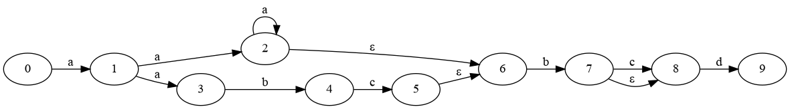

# t-rex: Tim's regular expressions engine

This is an implementation of regular expressions library and a simple command-line application.
It uses regular expressions variant mostly consistent with [POSIX] (e.g. grep). 

## Features

* Matching individual characters like `a`, `8`, or `\t`.
* Character sets `[a-z0-9]` and negated sets `[^0-9]` (not a number).
* Alterations, like `a|b`, `dog|cat`.
* Repetitions, e.g. `a?` (zero or one), `a+` (more than one), `a*` (any number), `a{5}` (exactly five), `a{2,3}`, etc.
* Sub-patterns can be grouped with brackets `(xo)+`.
* Matching group of characters like words `\w`, digits `\d`.
* Beginning `^` and end `$` of the string, or word bounds `\b`.

Character groups using the `[[:alnum:]]` syntax are not supported. Other features available in some
regular expression syntaxes like references to subpatterns `\1`, or lazy matching `*?`, are also not supported.

## Implementation

The implementation is bease on [Ken Thompson]'s NFA. More details can be found also in the chapter
by [Ullman], and multiple blog posts, inclugin [Russ Cox], [Denis Kyashif], [Alex Grebenyuk], etc.

Regular expression is parsed to a non-deterministic finite automata (NFA). This helps to avoid
[backtracking] and makes it run in linear, rather than exponential, time as describd by [Russ Cox].

For example, regular expression `a(a+|abc)bc?d` gets compiled to the graph shown below.
Matching single characters like `a` are state transitions. Alterations, like
`a+|abc` are alternative branches of the graph. The any number of matches `a*` would
become a cycle in the graph, and `a+` is equivalent to `aa*` so it leads to a cycle as well.
`c?` matches `c` zero or one times, so there's an additional arrow marked  as ε which jumps
unconditionally to the next state.  



*The graph visualization was generated using Graphviz's dot format by command-line application with `--graph` flag.*

The graph gets compiled to states

```rust
struct State {
    arrows: Vec<Arrow>,
    end: bool,
}
```

which are connected by arrows

```rust
enum Arrow {
    // unconditional jump
    Epsilon(&State),
    // conditional jump
    Match(fn(char) -> bool, &State),
}
```

though, the actual implementation is slightly more complicated to satisfy Rust's borrow checker rules.

If the `a(a+|abc)bc?d` regular expression was used to match the `xaabd` string, it would simultaneously
explore multiple paths to the solution, as illustrated below. The matching happens one
character at the time, where the character is matched against all the branches of the graph
it could reach.

1. "x" does not match `a`, skipping this character and trying to match from the next one
2. "a" was matched, so the (1) state got reached
3. second "a"
   1. matched `a+` from the left branch (2), and
   2. matched `a` from the right branch (3) simultaneously
4. "b"
   1. did not match possible repetition of `a+` (2), so left branch jumps to state (6) and matches `b` and succeeds reaching state (7)
   2. matched `b` in the right branch (3)
5. "d"
   1. "d" did not match `c?`, so it jumped to state (8) and matched `d` (9) finishing the match
   2. did not match `c` so processing this branch stops

The algorithm can be also illustrated using Rust pseudo-code (again, simplified):

```rust
queue.push(initial_state);

for i in 0..=chars.len() {
    for j in i..=chars.len() {
        let mut next = Queue::default();
        while let Some(state) = queue.pop() {
            if state.is_final() {
                // success
                return true;
            }
            for arrow in &state.arrows() {
                match arrow {
                    Epsilon(s) => {
                        // instantly jump to next state
                        queue.push(s.clone());
                    }
                    Match(v, s) => {
                        if let Some(c) = chars.get(j)
                            && v.is_match(c)
                        {
                            // add states to be used for
                            // matching the next character
                            next.push(s.clone());
                        }
                    }
                }
            }
        }
        // using the queue for the next character
        queue = next;
    }
    // no success so let's try matching from i+1 character
}
// failure
```

An important implementation detail to ensure performance of the engine, is that
the `Queue` does not accept duplicated states, so if multiple paths would lead to the same state,
it would not be re-visited saving unnecessary computations.

## Testing

The implementation was [tested] against over 900 unit tests from the [AT&T's ast] library regex engine test suite
passing most of the tests. The non-passing tests are mostly due to different implementation details.

## Grammar

The [POSIX] grammar is fully described in the Linux regex(7) man page.

```text
NUM := a non-negative integer
CHAR := any character
SPECIAL := ^.[$()|*+?{\'"

regex := branch [ '|' branch ]*
branch := piece*
piece := atom ( '*' | '?' | '+' | bound )?
bound := '{' NUM ( ',' NUM )? '}'
atom := CHAR | escaped | '(' regex ')'
bracket := '[' '^'? [ '-' | ']' ]? ( range | CHAR )? '-'? ']'
range := CHAR '-' CHAR
escaped := '\' [ SPECIAL | [wWdDsSbBnrt0] | xNN | uNNNN ]
```

[POSIX]: https://www.man7.org/linux/man-pages/man7/regex.7.html
[Russ Cox]: https://swtch.com/~rsc/regexp/regexp1.html
[Denis Kyashif]: https://deniskyashif.com/2019/02/17/implementing-a-regular-expression-engine/
[Alex Grebenyuk]: https://kean.blog/post/lets-build-regex
[Ullman]: http://infolab.stanford.edu/~ullman/focs/ch10.pdf
[Ken Thompson]: https://dl.acm.org/doi/epdf/10.1145/363347.363387
[backtracking]: https://stackoverflow.com/questions/79058777/how-does-regex-decide-when-to-backtrack
[AT&T's ast]: https://github.com/att/ast/blob/master/src/cmd/re/
[tested]: https://stackoverflow.com/questions/15819919/where-can-i-find-unit-tests-for-regular-expressions-in-multiple-languages
